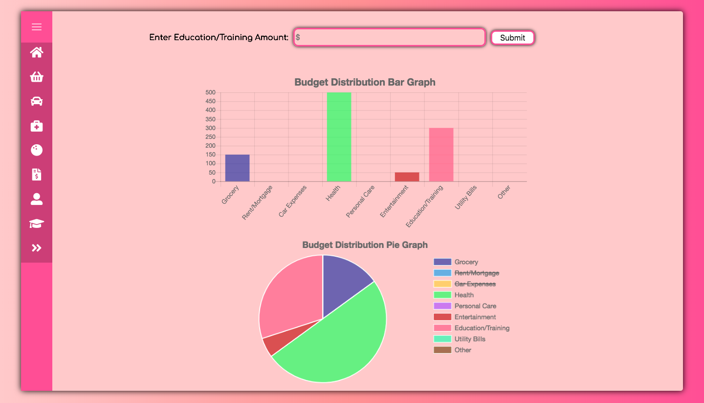

# Budget Planner

## Introduction video

https://youtu.be/OOc9cAbcpD0
## Install Side Nav
Install react-sidenav:

npm install --save react @trendmicro/react-sidenav

At this point you can import @trendmicro/react-sidenav and its styles in your application as follows:
import SideNav, { Toggle, Nav, NavItem, NavIcon, NavText } from '@trendmicro/react-sidenav';

Be sure to include styles

import '@trendmicro/react-sidenav/dist/react-sidenav.css';

    <SideNav
    onSelect={(selected) => {
        console.log(selected)
         this.setState({
             ...this.state,
             item:selected,
         })
        if(this.state.class=="inputContainer hide"){
            this.setState({
                ...this.state,
                class: 'inputContainer',
            })}
    }}
    onToggle={()=>{
        
            this.setState({
                ...this.state,
                class: 'inputContainer hide'
            })
       
    }}
        >
    <SideNav.Toggle />
    <SideNav.Nav defaultSelected="">
        <NavItem eventKey="Rent/Mortgage" active>
            <NavIcon>
                <i className="fa fa-fw fa-home" style={{ fontSize: '1.75em' }} />
            </NavIcon>
            <NavText>
                Rent/Morgage
            </NavText>
        </NavItem >
        <NavItem eventKey="Grocery" active>
            <NavIcon>
                <i className="fas fa-shopping-basket" style={{ fontSize: '1.75em' }} />
            </NavIcon>
            <NavText>
                Grocery
            </NavText>
            </NavItem >
            <NavItem eventKey="Car Expenses" active>
            <NavIcon>
                <i className="fas fa-car" style={{ fontSize: '1.75em' }} />
            </NavIcon>
            <NavText>
                Car Expenses
            </NavText>
            </NavItem>
            <NavItem eventKey="Health" active>
            <NavIcon>
                <i className="fas fa-briefcase-medical" style={{ fontSize: '1.75em' }} />
            </NavIcon>
            <NavText>
                Health
            </NavText>
            </NavItem>
            <NavItem eventKey="Entertainment" active>
            <NavIcon>
                <i className="fas fa-bowling-ball" style={{ fontSize: '1.75em' }} />
            </NavIcon>
            <NavText>
                Entertainment
            </NavText>
            </NavItem>
            <NavItem eventKey="Utility Bills" active>
            <NavIcon>
                <i className="fas fa-file-invoice-dollar" style={{ fontSize: '1.75em' }} />
            </NavIcon>
            <NavText>
                Utility Bills
            </NavText>
            </NavItem>
            <NavItem eventKey="Personal Care" active>
            <NavIcon>
                <i className="fas fa-user-alt" style={{ fontSize: '1.75em' }} />
            </NavIcon>
            <NavText>
                Personal Care
            </NavText>
            </NavItem>
            <NavItem eventKey="Education/Training" active>
            <NavIcon>
                <i className="fas fa-graduation-cap" style={{ fontSize: '1.75em' }} />
            </NavIcon>
            <NavText>
                Education/Training
            </NavText>
            </NavItem>
            <NavItem eventKey="Other" active>
            <NavIcon>
                <i className="fas fa-angle-double-right" style={{ fontSize: '1.75em' }} />
            </NavIcon>
            <NavText>
                Other
            </NavText>
            </NavItem>
    </SideNav.Nav>
     </SideNav>

## Installation Chart.js
npm install react-chartjs-2 chart.js --save

* **Usage**

import {Doughnut,Pie, Line, Bar} from 'react-chartjs-2';

<Doughnut data={...} />

       <Bar
                  
            data={this.state.chartData}
            options={{
                title:{
                    display:true,
                    text:'Budget Distribution Bar Graph',
                    fontSize:20,
                },
                legend:{
                    display: false,
                },
                scales: {
                    xAxes: [{
                        ticks: {
                            fontSize: 13
                        }
                    }]
                }
            }}
        />
or you can insert Pie Chart;

           <Pie
            data={this.state.chartData} 
            options={{

                title:{
                    display:true,
                    text:'Budget Distribution Pie Graph',
                    fontSize:20,
                },
                legend:{
                    display: true,
                     position: 'right',
                     labels:{
                         fontSize: 15,
                     }
                }
            }}
        />
